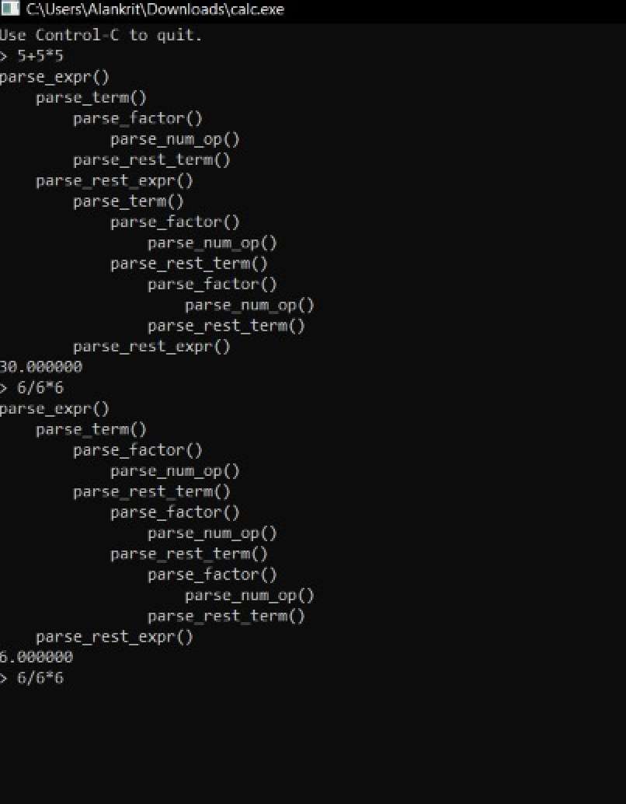

# CLI-calculator
A command line calculator which supports mathematical expressions with scientific functions is very useful for most developers.

Command-Line Calculator (CLCalculator) provides the most fluid interface, especially if you are performing chained calculations i.e. multiple calculations that rely on the results of previous calculations.

## Demo

